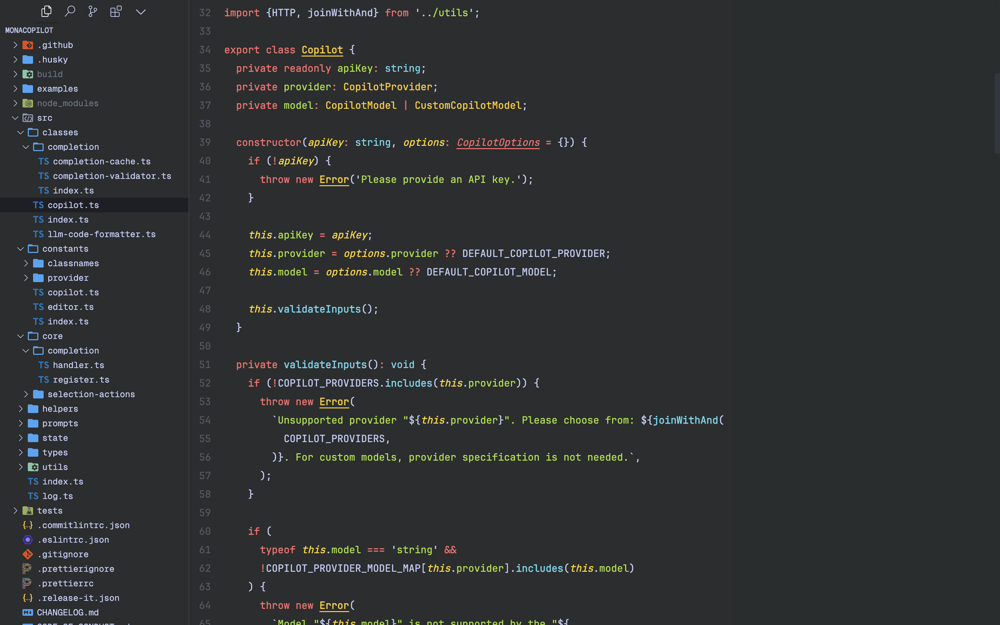

# Cortex Theme for Visual Studio Code

A sleek, dark color theme for Visual Studio Code.

[Download](https://marketplace.visualstudio.com/items?itemName=arshad-yaseen.cortex-theme)

## Customization

Cortex Theme comes in two variants:

- Cortex Dark: The standard dark theme
- Cortex Dark Soft: A slightly softer version for reduced eye strain (recommended for long coding sessions)

To switch between variants, use the Color Theme menu in VS Code.

## Feedback and Contributions

We welcome your feedback and contributions! Please visit our [GitHub repository](https://github.com/arshad-yaseen/cortex-theme) to report issues, suggest improvements, or contribute to the theme's development.

## License

This theme is released under the [MIT License](LICENSE).

Enjoy coding with Cortex Theme!
