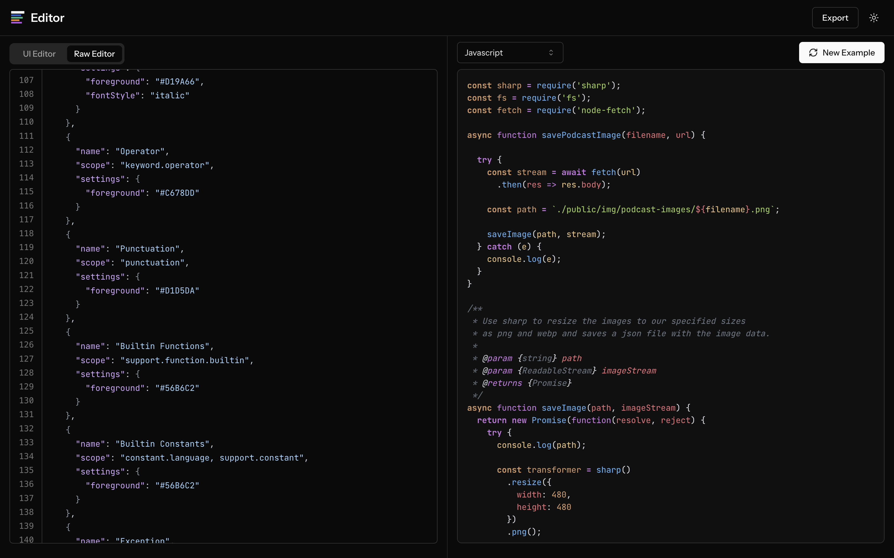
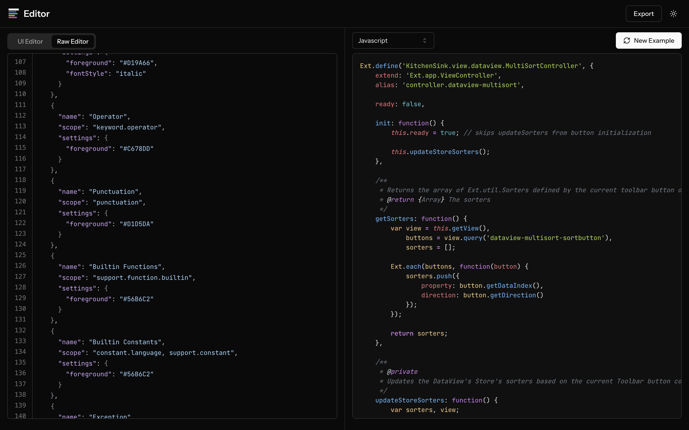

## Cortex Dark

### Languages with Full Support

- JavaScript/TypeScript
- Python
- JSON
- YAML
- HTML
- CSS

### Color Palette

| Element     | HSL                | RGB                | HEX     |
| ----------- | :----------------- | :----------------- | :------ |
| Background  | hsl(0, 0%, 6%)     | rgb(16, 16, 16)    | #101010 |
| Foreground  | hsl(214, 13%, 83%) | rgb(209, 213, 218) | #D1D5DA |
| Comments    | hsl(212, 8%, 45%)  | rgb(106, 115, 125) | #6A737D |
| Strings     | hsl(84, 55%, 55%)  | rgb(158, 203, 74)  | #9ECB4A |
| Numbers     | hsl(29, 54%, 61%)  | rgb(209, 154, 102) | #D19A66 |
| Keywords    | hsl(286, 60%, 67%) | rgb(198, 120, 221) | #C678DD |
| Functions   | hsl(207, 82%, 66%) | rgb(97, 175, 239)  | #61AFEF |
| Variables   | hsl(355, 65%, 65%) | rgb(224, 108, 117) | #E06C75 |
| Constants   | hsl(29, 54%, 61%)  | rgb(209, 154, 102) | #D19A66 |
| Classes     | hsl(39, 67%, 69%)  | rgb(229, 192, 123) | #E5C07B |
| Types       | hsl(187, 47%, 55%) | rgb(86, 182, 194)  | #56B6C2 |
| Operators   | hsl(286, 60%, 67%) | rgb(198, 120, 221) | #C678DD |
| Punctuation | hsl(214, 13%, 83%) | rgb(209, 213, 218) | #D1D5DA |

## Cortex Light

The Cortex Light theme is currently under construction and undergoing further refinements.
